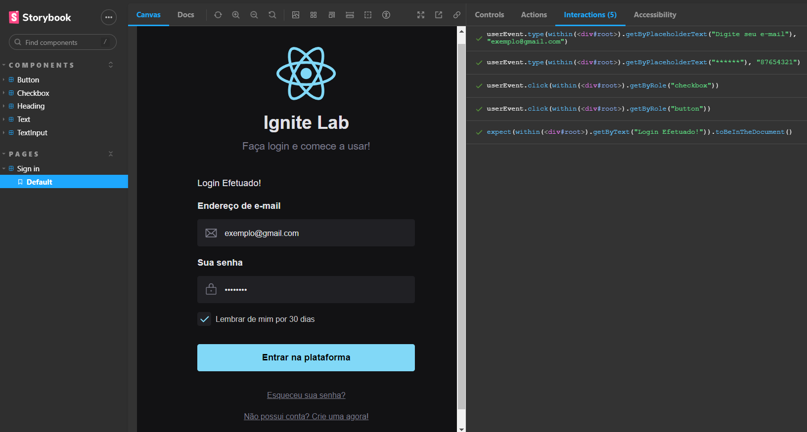

# Ignite Lab - Design System



Projeto desenvolvido no **Ignite Lab 3** da [Rocketseat](https://www.rocketseat.com.br/). A aplicação teve as seguintes etapas de construção:
- Projeto no Figma
- Design System - Criação dos componentes 
- Documentação no Storybook
- Deploy automatizado com GitHub Actions
- Criação do Front-End em Vite
- Implementação de testes com Jest no Storybook.

<br />

## 🔮 Tecnologias e ferramentas utilizadas

- [React.JS (Vite)](https://vitejs.dev/)
- [TypeScript](https://www.typescriptlang.org/)
- [Radix UI](https://www.radix-ui.com/)
- [Tailwind CSS](https://tailwindcss.com/)
- [Storybook](https://storybook.js.org/)
- [Addon A11y](https://www.npmjs.com/package/@storybook/addon-a11y)
- [Github Actions](https://github.com/features/actions)
- [Jest](https://jestjs.io/pt-BR/)
- [MSW](https://mswjs.io/) 

Para acessar a documentação no Storybook [Clique aqui!](https://evertonvargas.github.io/ignite-lab-design-system/)

## 🚀 Instalação e uso

Clone o projeto e acesse a pasta

```bash
$ git clone https://github.com/evertonvargas/ignite-lab-design-system

```

Siga os passos abaixo
```bash
# Install the dependencies
$ npm i

# Start the project
$ npm run dev

# Start StoryBook
$ npm run storybook
```
